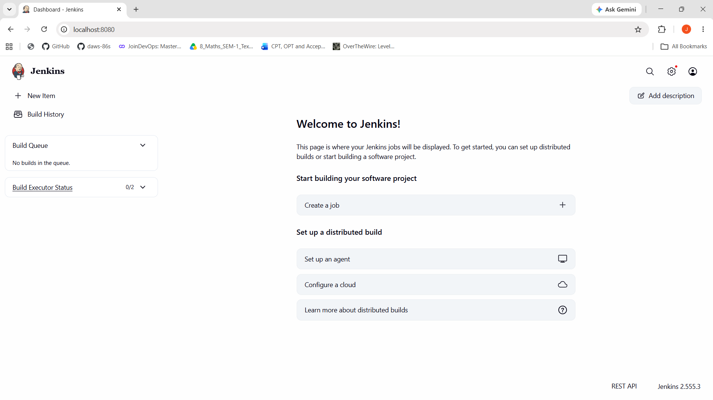
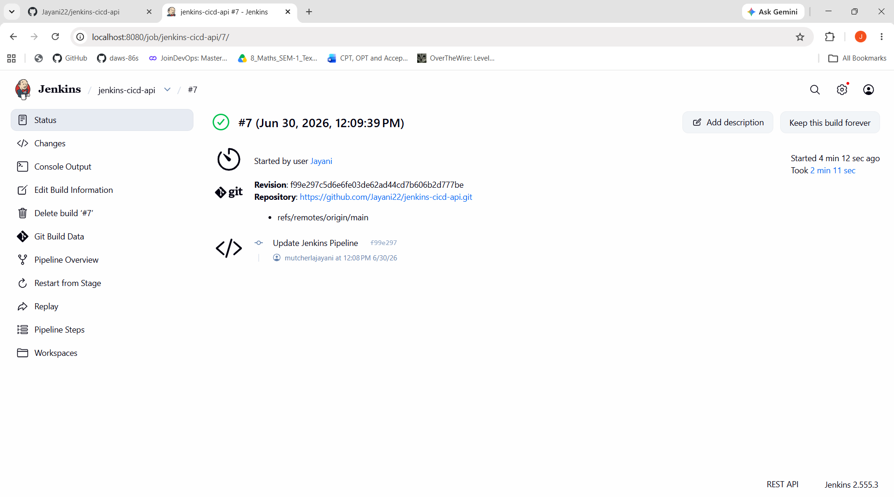
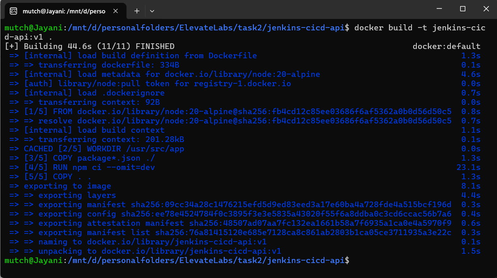
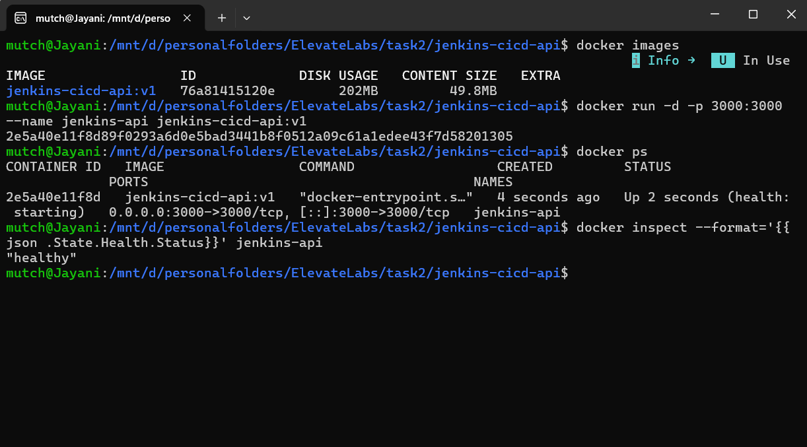
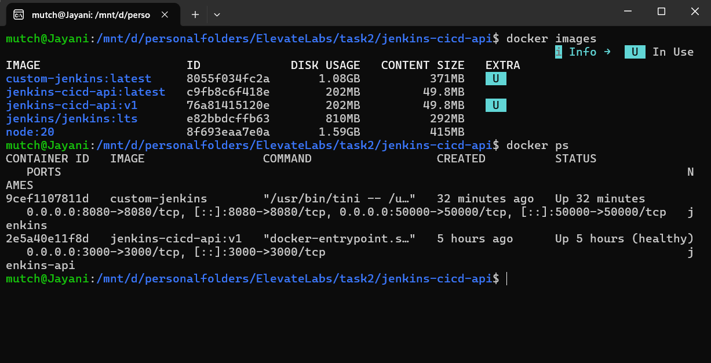
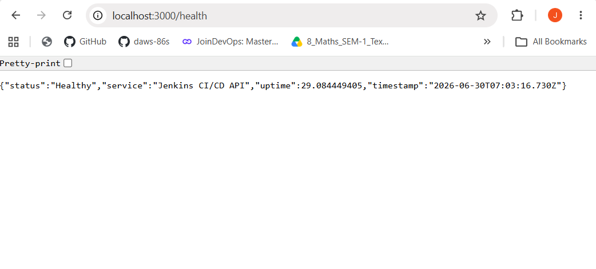
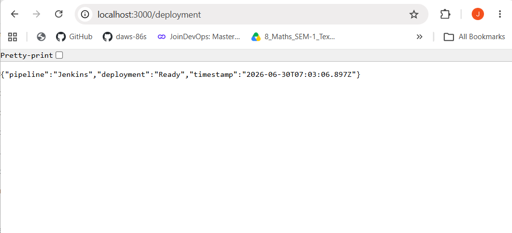
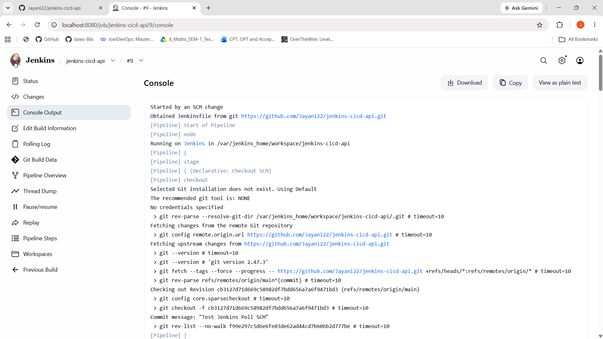
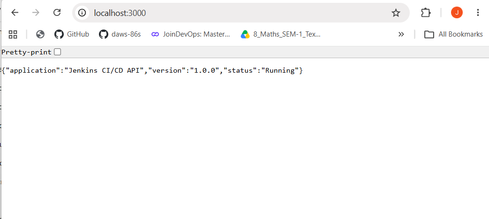
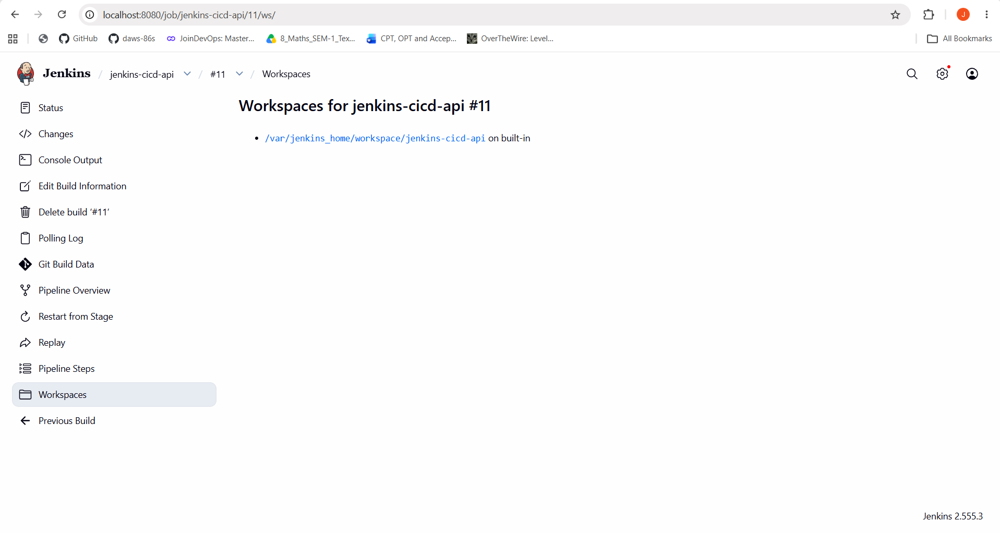

# Jenkins CI/CD Pipeline for Node.js Application

A production-inspired Jenkins CI/CD pipeline that automatically builds, tests, containerizes, and deploys a Node.js application using Docker.

---

## Project Overview

This project demonstrates how to automate the software delivery process using **Jenkins** and **Docker**.

A lightweight Node.js REST API was developed and integrated with Jenkins to automatically perform Continuous Integration (CI) tasks whenever changes are detected in the source code.

The pipeline performs the following operations:

- Checkout source code from GitHub
- Verify Docker environment
- Install project dependencies
- Execute automated unit tests
- Build Docker image
- Run Docker container
- Verify application health
- Clean up temporary containers

This project provides practical experience with Jenkins Pipelines, Docker, automated testing, and CI/CD best practices.

---

# Objectives

- Learn Jenkins Pipeline fundamentals
- Automate application build and testing
- Containerize applications using Docker
- Validate application health automatically
- Understand Continuous Integration workflows

---

# Features

- Jenkins Declarative Pipeline
- GitHub Webhook Integration
- Automatic Pipeline Trigger on Code Push
- Dockerized Node.js Application
- Automated Unit Testing
- Health Check Endpoint
- Docker Image Build
- Automatic Container Execution
- Pipeline Cleanup
- Production-inspired CI/CD Workflow

---

# Architecture

```text
                Developer
                    │
              Push Code
                    │
                    ▼
               GitHub Repository
                    │
           GitHub Webhook Trigger
                    │
                    ▼
                 Jenkins Server
                    │
      ┌─────────────┼─────────────┐
      ▼             ▼             ▼
 Checkout      Install NPM      Run Tests
                    │
                    ▼
          Build Docker Image
                    │
                    ▼
          Run Docker Container
                    │
                    ▼
         Health Check Validation
                    │
                    ▼
             Cleanup Resources
                    │
                    ▼
          Pipeline Completed
```

---

# Jenkins Pipeline Workflow

The pipeline executes the following stages:

1. Checkout Source Code
2. Verify Docker Environment
3. Install Dependencies
4. Run Unit Tests
5. Build Docker Image
6. Run Docker Container
7. Health Check Validation
8. Cleanup

---

# Project Structure

```text
jenkins-cicd-api
│
├── jenkins/
│   └── Dockerfile
│
├── screenshots/
│
├── src/
│   ├── routes/
│   │      └── api.js
│   │
│   ├── utils/
│   │      └── deploymentInfo.js
│   │
│   ├── app.js
│   └── server.js
│
├── tests/
│   └── app.test.js
│
├── Dockerfile
├── Jenkinsfile
├── .dockerignore
├── .gitignore
├── LICENSE
├── README.md
├── package.json
└── package-lock.json
```

---

# Technology Stack

| Category | Technology |
|-----------|------------|
| Language | JavaScript |
| Runtime | Node.js |
| Framework | Express.js |
| Testing | Jest, Supertest |
| CI/CD | Jenkins |
| Containerization | Docker |
| Version Control | Git & GitHub |

---

# API Endpoints

| Method | Endpoint | Description |
|---------|----------|-------------|
| GET | `/` | Returns application details |
| GET | `/health` | Returns application health |
| GET | `/deployment` | Returns deployment status |

---

# Installation

Clone the repository

```bash
git clone https://github.com/jayani22/jenkins-cicd-api.git
```

Move into the project directory

```bash
cd jenkins-cicd-api
```

Install dependencies

```bash
npm install
```

Start the application

```bash
npm start
```

---

# Run Unit Tests

```bash
npm test
```

---

# Docker Commands

Build Docker Image

```bash
docker build -t jenkins-cicd-api .
```

Run Docker Container

```bash
docker run -d -p 3000:3000 jenkins-cicd-api
```

List Containers

```bash
docker ps
```

Stop Container

```bash
docker stop <container-id>
```

---

# Jenkins Pipeline

The pipeline is defined inside:

```text
Jenkinsfile
```

Pipeline stages:

- Checkout Source
- Verify Docker
- Install Dependencies
- Run Unit Tests
- Build Docker Image
- Run Docker Container
- Health Check
- Cleanup

---

# Automatic Pipeline Trigger

This project supports automatic CI/CD execution using GitHub and Jenkins.

Whenever code is pushed to the `main` branch:

1. GitHub detects the new commit.
2. GitHub sends a webhook notification to Jenkins.
3. Jenkins automatically starts the pipeline.
4. The application is built, tested, containerized, deployed, and verified.

Pipeline Trigger Flow:

```text
Developer
    │
git push
    │
    ▼
GitHub Repository
    │
GitHub Webhook
    │
    ▼
Jenkins Pipeline
    │
Checkout
    │
Install Dependencies
    │
Run Tests
    │
Docker Build
    │
Deploy Container
    │
Health Check
    │
Pipeline Success
```

---

# Project Screenshots

## Jenkins Dashboard



---

## Successful Pipeline



---

## Docker Build



---

## Running Container



---

## Docker Image


---

## Health Endpoint



---

## Deployment Endpoint



---

## Test Results



---

## API HOME



---

## GitHub Webhook Trigger



# Project Highlights

- Jenkins Declarative Pipeline
- Docker Integration
- Automated Unit Testing
- Containerized Deployment
- Health Check Validation
- Modular Express.js Application
- Docker-based Build Environment
- Pipeline Cleanup
- CI/CD Automation

---

# Future Enhancements

- GitHub Webhooks
- Docker Hub Integration
- Kubernetes Deployment
- SonarQube Code Analysis
- Slack Notifications
- Email Notifications
- Multi-stage Docker Builds
- Terraform Infrastructure

---

# Interview Concepts Covered

- Jenkins
- Jenkinsfile
- Declarative Pipeline
- CI/CD
- Docker
- Docker CLI
- Docker Socket
- Docker Volumes
- Automated Testing
- Build Automation
- Health Checks

---

# Author

**Jayani Mutcherla**

Aspiring DevOps Engineer with hands-on experience in Jenkins, Docker, Git, CI/CD pipelines, and Infrastructure Automation.

---

# License

This project is licensed under the MIT License.